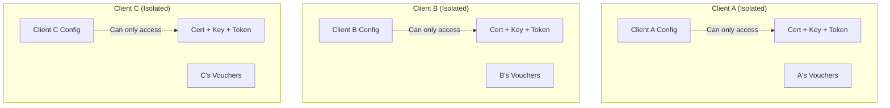
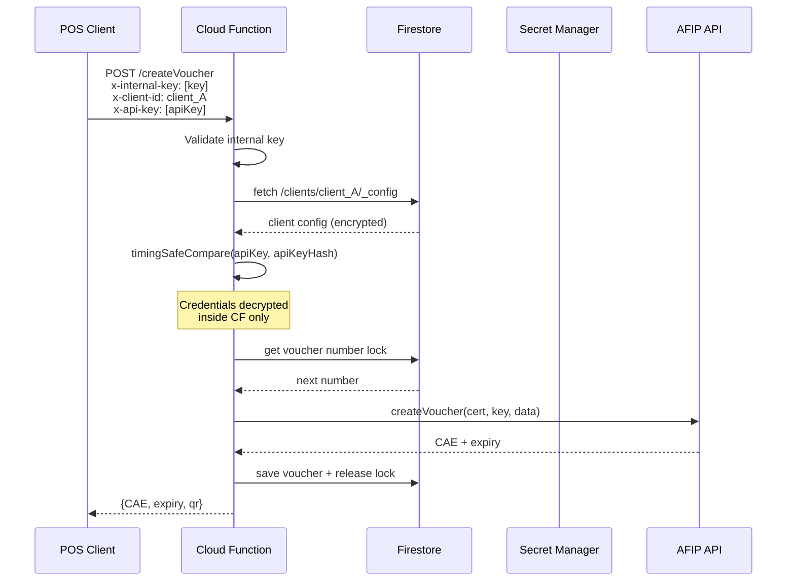
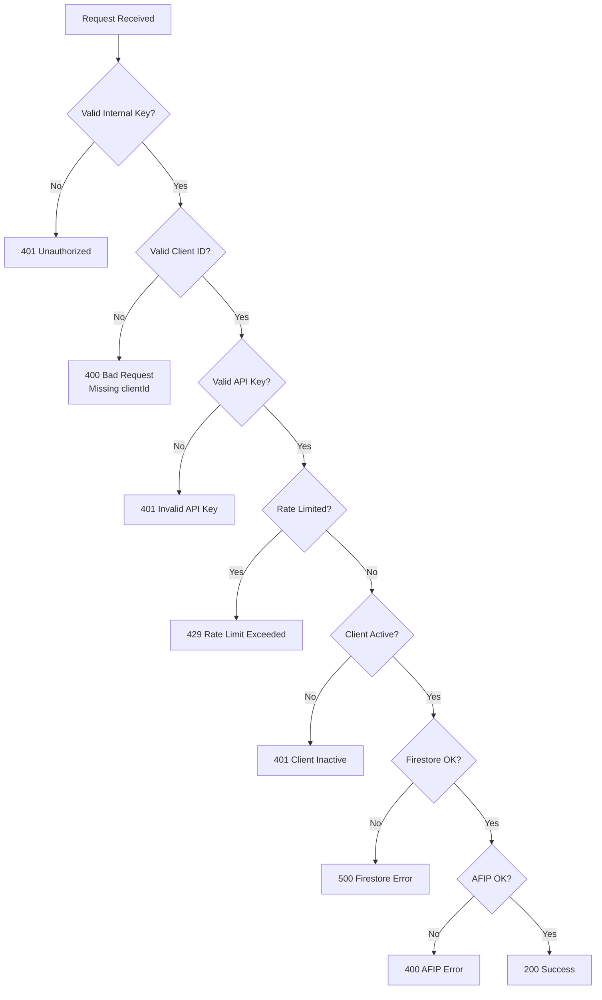
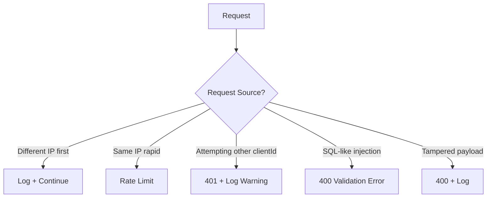
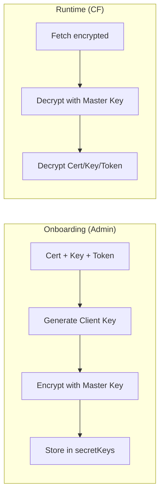

# Architecture Documentation

## System Overview

```
┌─────────────────────────────────────────────────────────────────────────┐
│                           POS CLIENTS                                  │
│    Client A          Client B          Client C          ...           │
│  ┌──────────┐    ┌──────────┐    ┌──────────┐                    │
│  │ API Key  │    │ API Key  │    │ API Key  │                    │
│  │ ClientID│    │ ClientID│    │ ClientID│                    │
│  └──────────┘    └──────────┘    └──────────┘                    │
└─────────────────────────────┬───────────────────────────────────────────┘
                            │ HTTPS
                            ▼
┌─────────────────────────────────────────────────────────────────────────┐
│                   FIREBASE CLOUD FUNCTION                             │
│                                                                  │
│  ┌─────────────────────────────────────────────────────────────┐   │
│  │ 1. AUTHENTICATION LAYER                                    │   │
│  │    - Internal key validation (x-internal-key header)         │   │
│  │    - Client ID extraction                                │   │
│  │    - API key validation + timing-safe comparison          │   │
│  │    - Rate limiting per client                              │   │
│  └─────────────────────────────────────────────────────────────┘   │
│                              │                                   │
│                              ▼                                   │
│  ┌─────────────────────────────────────────────────────────────┐   │
│  │ 2. CREDENTIALS RESOLUTION                                │   │
│  │    - Fetch client config from Firestore                    │   │
│  │    - Decrypt credentials with client key               │   │
│  │    - Each client has isolated credentials              │   │
│  └─────────────────────────────────────────────────────────────┘   │
│                              │                                   │
│                              ▼                                   │
│  ┌─────────────────────────────────────────────────────────────┐   │
│  │ 3. AFIP PROCESSING                                       │   │
│  │    - Voucher number locking (Firestore)                │   │
│  │    - AFIP API call                                      │   │
│  │    - Save voucher to Firestore                         │   │
│  └─────────────────────────────────────────────────────────────┘   │
└─────────────────────────────┬───────────────────────────────────────┘
                             │
        ┌────────────────────┼────────────────────┐
        ▼                    ▼                    ▼
┌──────────────┐    ┌──────────────┐    ┌──────────────┐
│   FIRESTORE   │    │   SECRETS    │    │  AFIP API   │
│  (Database)  │    │  (GCP SM)   │    │  (External) │
└──────────────┘    └──────────────┘    └──────────────┘
        │                    │                    │
        │                    │                    │
        ▼                    ▼                    ▼
┌──────────────┐    ┌──────────────┐    ┌──────────────┐
│Client Config │    │Master Key   │    │Create      │
│Vouchers    │    │Client Keys │    │Voucher    │
│Rate Limits │    │            │    │Get Last #  │
└──────────────┘    └──────────────┘    └──────────────┘
```

## Security Isolation Model



## Data Flow



## Edge Cases and Error Handling



## Malicious Request Handling



## Firestore Schema

```
/
├── clients/
│   └── {clientId}/
│       ├── _config/
│       │   ├── apiKeyHash: "sha256 of api key"
│       │   ├── active: true
│       │   ├── encryptionKeyId: "key_xxx"
│       │   └── afip/
│       │       ├── CUIT: "30-xxx"
│       │       ├── razonSocial: "Business Name"
│       │       ├── puntoVenta: 1
│       │       ├── condicionIva: "RESPONSABLE_INSCRIPTO"
│       │       ├── encryptedCert: "iv:cert"
│       │       ├── encryptedKey: "iv:key"
│       │       └── accessToken: "iv:token"
│       └── vouchers/
│           └── {year}/
│               └── {month}/
│                   └── {timestamp}_{uuid}/
│                       ├── tipoFactura: 1
│                       ├── numero: 1
│                       ├── cae: "123..."
│                       └── ...
│
├── secretKeys/
│   └── {keyId}/
│       └── encryptedKey: "iv:clientKey"
│
├── voucherNumbers/
│   └── {clientId}_{puntoVenta}_{tipoFactura}/
│       ├── lastNumber: 1
│       └── locked: false
│
├── rateLimits/
│   └── {clientId}/
│       └── logs/
│           └── {timestamp}/
│               └── timestamp
│
└── taCache/
    └── {clientId}/
        ├── token: "iv:token"
        ├── sign: "iv:sign"
        └── expiresAt: timestamp
```

## Encryption Flow



## File Structure

```
src/
├── index.ts                    # Cloud Function handlers
├── functions/
│   ├── createVoucher.ts      # Business logic for vouchers
│   └── registerClient.ts      # Client registration
├── services/
│   ├── afip.ts              # AFIP SDK integration
│   ├── client-auth.ts       # Client authentication
│   ├── encryption.ts        # Encryption utilities
│   ├── errors.ts            # Custom error classes
│   ├── firestore.ts        # Firestore operations
│   └── rate-limiter.ts     # Rate limiting
├── utils/
│   └── validation.ts       # Additional validation
└── types/
    └── arca.ts            # TypeScript types
```