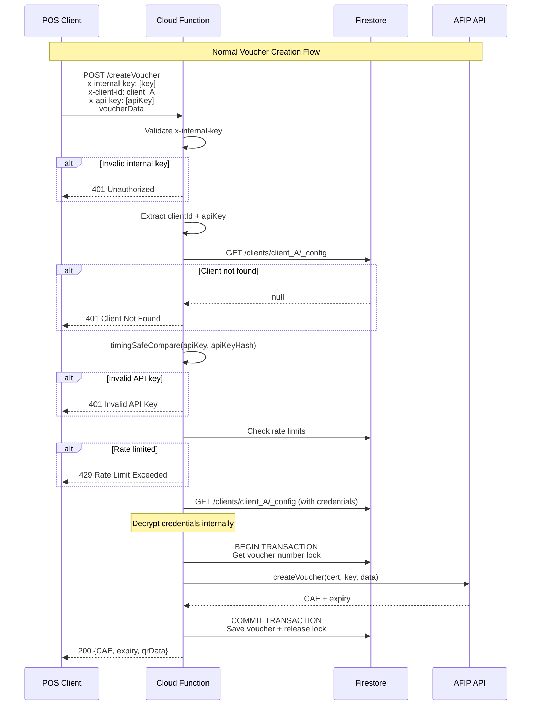
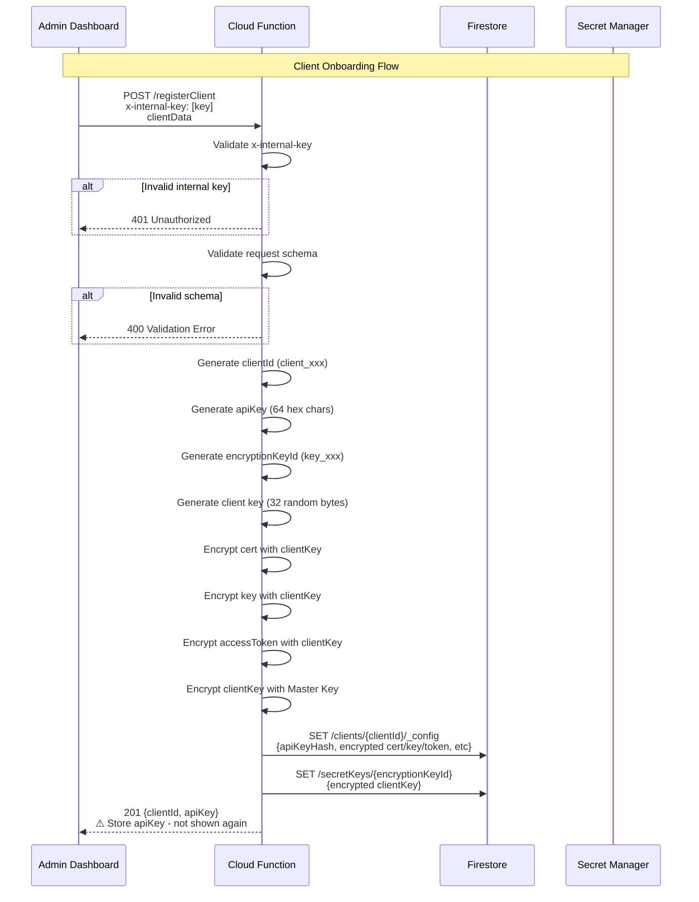
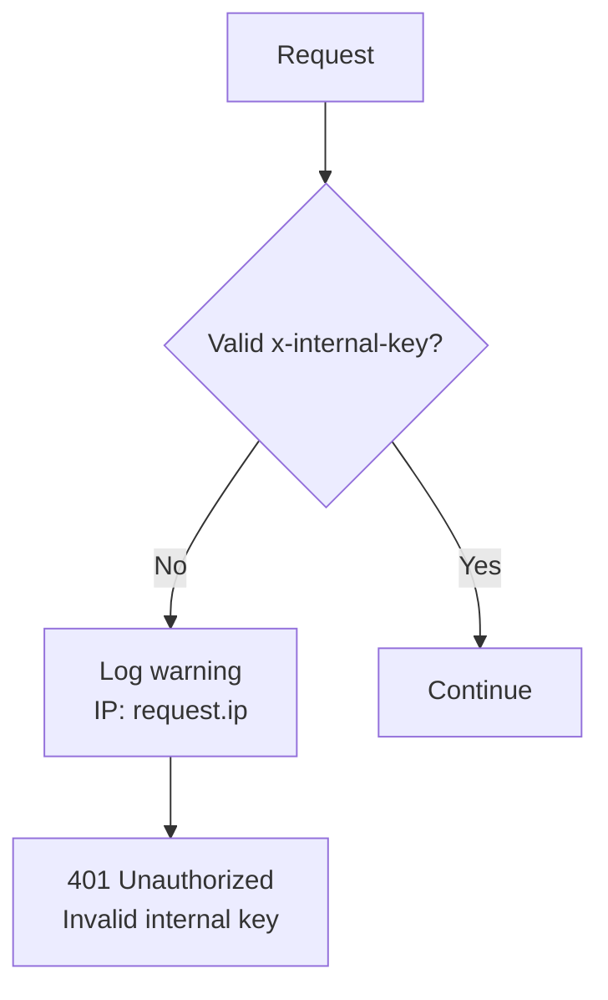
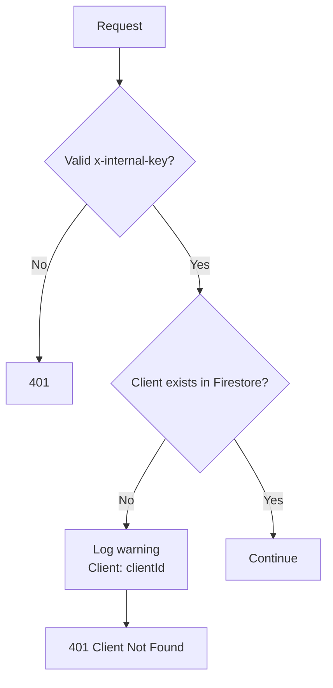
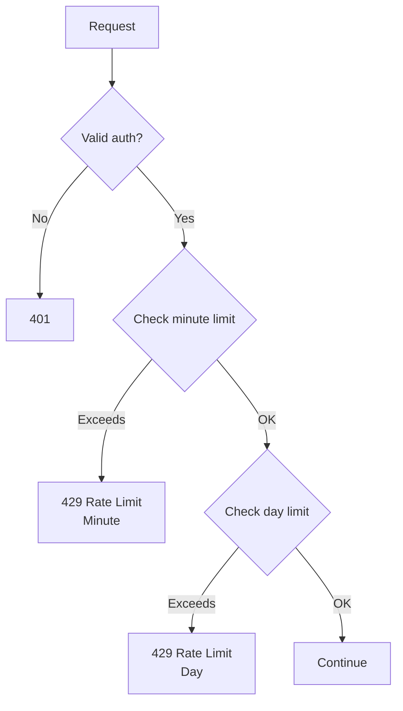
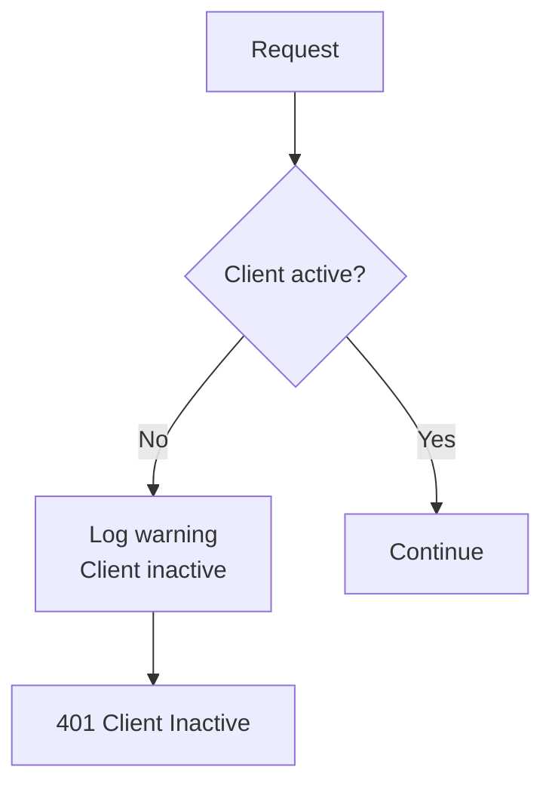
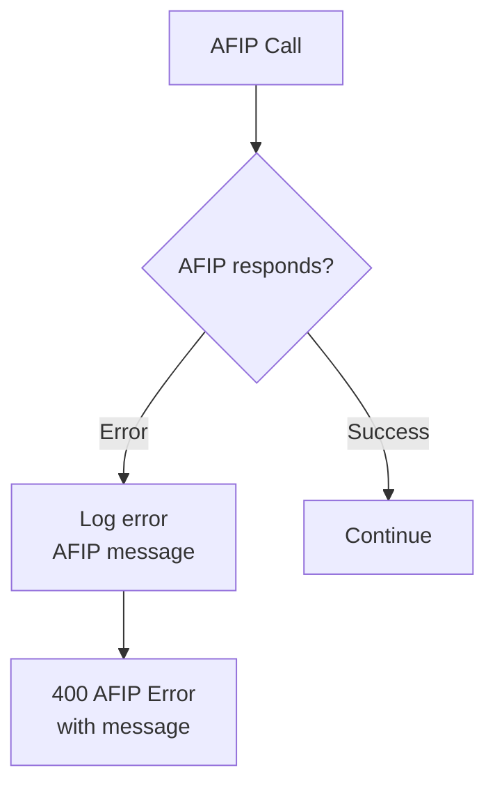
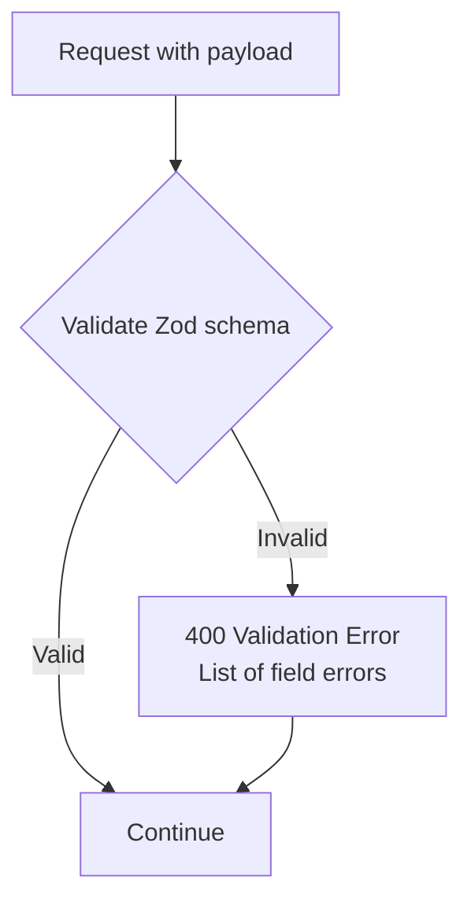
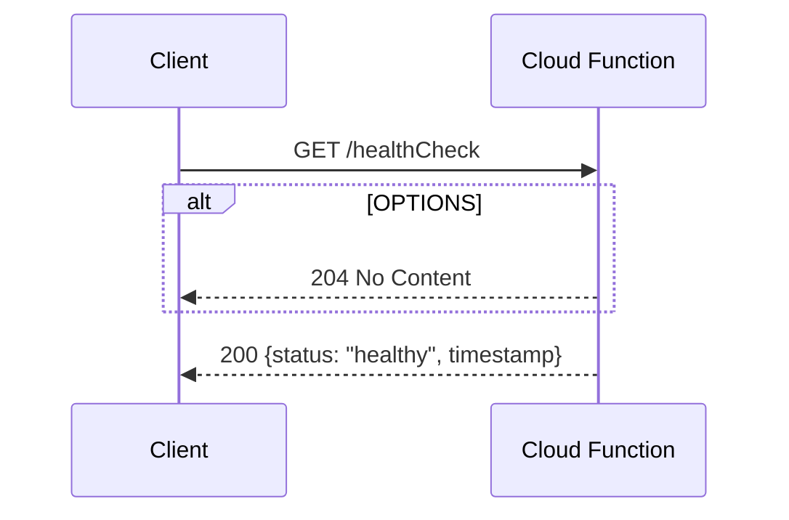
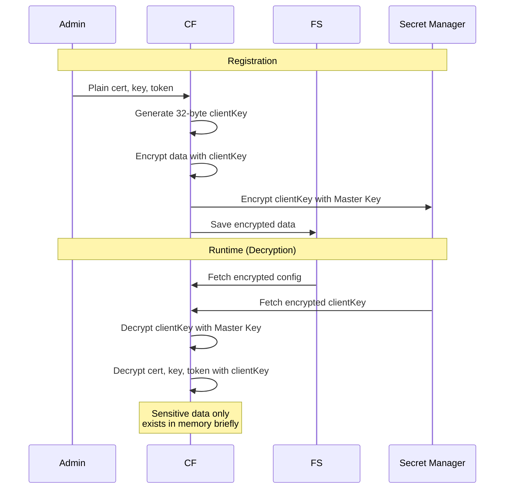

# Activity Diagrams

## Normal Flow: Create Voucher



## Registration Flow: New Client



## Edge Cases: Error Handling

### Invalid Internal Key



### Invalid Client ID



### Invalid API Key (Timing Attack Safe)

```mermaid
graph TD
    A[Request] --> B{Valid internal key?}
    B -->|No| E[401]
    B -->|Yes| C{Client exists?}

    C -->|No| F[401]
    C -->|Yes| D{timingSafeCompare(apiKey, hash)}

    D -->|Yes| G[Continue to rate limit]
    D -->|No| H[Log warning<br/>Invalid API key attempt]
    H --> I[401 Invalid API Key]

    Note over D,I: All comparisons take same time<br/>prevents timing attacks
```

### Rate Limit Exceeded



### Client Inactive



### AFIP API Error



## Malicious Request Handling

### Attempting to Access Other Client Data

```mermaid
graph TD
    A[Request with clientId_B] --> B{Client B exists?}
    B -->|No| C[401 Client Not Found]
    B -->|Yes| D{API key matches?}

    D -->|No for B| E[401 Invalid API Key]

    Note over D: Even if clientId exists,<br/>wrong API key = rejection
```

### SQL Injection Attempt



### Replay Attack Prevention

```mermaid
graph TD
    A[Request] --> B{Timestamp in payload?}

    B -->|Old (>5 min)| C[400 Request Expired]
    B -->|Recent| D[Continue]

    Note over B,D: Each request should have<br/>timestamp and be recent
```

### Credential Stuffing

```mermaid
graph TD
    A[Multiple attempts<br/>different apiKeys] --> B{Attempts > threshold?}

    B -->|Yes| C[Log suspicious activity<br/>IP: x, clientId: y]
    B -->|No| D[Continue]

    C --> E[Temporarily block IP]

    Note over A,E: System logs all auth failures<br/>for security monitoring
```

## Health Check Flow



## Data Isolation Verification

```mermaid
graph TD
    subgraph "Client A"
        A1[Client A Certificates]
        A2[Client A Vouchers]
    end

    subgraph "Client B"
        B1[Client B Certificates]
        B2[Client B Vouchers]
    end

    A1 --> |"Can only access"| A2
    B1 --> |"Can only access"| B2

    A1 -.-> |"Cannot access"| B1
    B1 -.-> |"Cannot access"| A1

    Note over A1,B1: Firestore rules ensure<br/>clients can only read<br/>their own data
```

## Encryption Flow Detail

